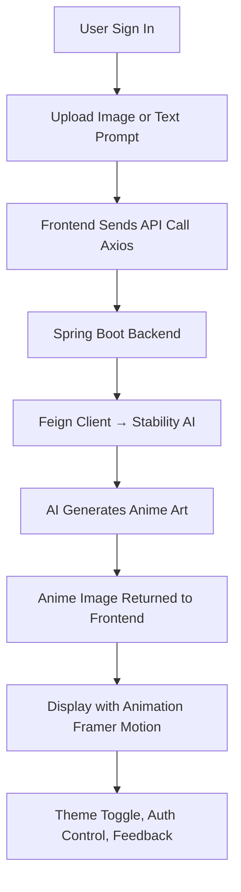

# 🧠 Anime Art – AI-Powered Image to Anime Converter

⚡ *Transform your real-world photos into anime-style art instantly using AI.*

A full-stack application built with **React + Vite** for the frontend, **Spring Boot** for the backend, and **Stability AI** for artistic transformation — all secured with **Clerk** authentication.


## 🎨 Output Preview

> Convert your ordinary images into dreamy anime worlds ✨

<!-- Add actual screenshots or generated examples here -->


---

## 📦 Project Overview

**Anime Art** is a smart and stylish AI SaaS that takes real-world images and turns them into stunning anime visuals using cutting-edge models. From a modern single-page frontend to a secure backend that calls AI services, this app provides:

- Seamless image upload and transformation

- Framer-motion-powered animations

- Clerk-based user authentication

- Style presets like *Ghibli*, *Dreamlike*, and more

---
## 🚀 Technologies Used

| 🧱 Layer        | 🛠️ Technologies                                                                                                                                     |
|----------------|------------------------------------------------------------------------------------------------------------------------------------------------------|
| 🎨 Frontend     | [React](https://reactjs.org), [Vite](https://vitejs.dev), [Tailwind CSS](https://tailwindcss.com), [Clerk](https://clerk.dev), [Framer Motion](https://www.framer.com/motion/) |
| 🧠 Backend      | [Spring Boot](https://spring.io/projects/spring-boot), [Feign Client](https://docs.spring.io/spring-cloud-openfeign/docs/current/reference/html/)  |
| 🤖 AI Provider  | [Stability AI](https://platform.stability.ai)                                                                                                       |
| 🧰 Other Tools  | [Axios](https://axios-http.com), REST APIs, DTO Mapping                                                                                             |

## ✨ Features

- 📸 Upload any image
- 🎨 Convert to anime in seconds via AI
- 🌗 Dark/Light theme switch
- 🔐 Secure user access with Clerk
- 🎞 Smooth animation using Framer Motion
- 🖼️ Multiple style support (*ghibli*, *dreamlike*, etc.)
- 🌌 Background animations for immersive UX


## 🏗️ Project Structure

### 🧠 Backend – `ghbliapi/`

```bash
ghbliapi/
├── pom.xml
└── src/
    └── main/
        ├── java/in/project/ghbliapi/
        │   ├── controller/             # Handles HTTP requests
        │   │   └── GenerationController.java
        │   ├── service/                # Business logic
        │   │   └── GhibliArtService.java
        │   ├── dto/                    # Data transfer objects
        │   │   ├── TextGenerationRequestDto.java
        │   │   └── TextToImageRequest.java
        │   ├── client/                 # Feign client to Stability AI
        │   │   └── StabilityAiClient.java
        │   └── config/
        │       └── feginConfig.java
        └── resources/
            └── application.properties
````

---

### 🎨 Frontend – `ghbliui/`

```bash
ghbliui/
├── index.html
├── vite.config.js
├── src/
│   ├── main.jsx                     # Entry point
│   ├── App.jsx                      # Layout & routes
│
│   ├── api/                         # API service
│   │   └── ghibliApi.js
│
│   ├── context/                     # Global state management
│   │   └── AppContext.jsx
│
│   ├── dto/                         # Matches backend DTOs
│   │   ├── textRequest.js
│   │   └── imageRequest.js
│
│   ├── components/                  # UI components
│   │   ├── Header.jsx
│   │   ├── BgSlider.jsx
│   │   ├── TryNow.jsx
│   │   ├── Pricing.jsx
│   │   ├── BgRemovalSteps.jsx
│   │   └── Testimonials.jsx   
│
│   ├── pages/
│   │   └── Home.jsx
│
│   ├── styles/
│   │   └── global.css
│
│   └── assets/
│       └── logo.svg, icons, images...
```

---

## 🌐 Environment Setup

### 📦 Prerequisites

| Tool    | Version  | Required For  |
| ------- | -------- | ------------- |
| Node.js | >= 18.x  | Frontend      |
| Java    | >= 17    | Backend       |
| Maven   | >= 3.8.x | Build Backend |

---

### 🚀 Run the App Locally

#### Frontend

```bash
cd ghbliui
npm install
npm run dev
# Runs on http://localhost:5173
```

#### Backend

```bash
cd ghbliapi
./mvnw spring-boot:run
# Runs on http://localhost:8080
```

---

## 🔑 Clerk Configuration

```env
VITE_CLERK_PUBLISHABLE_KEY=your_clerk_publishable_key
```

---

## 📡 AI Integration (Stability AI)

* Uses Feign Client in backend (`StabilityAiClient.java`)
* Accepts prompts or image input and sends to Stability AI
* Styles like `ghibli`, `anime`, etc. configured in frontend

---


## 🔄 User Workflow Diagram



## 📸 Screenshots

1️⃣ Upload Screen
2️⃣ Style Selection
3️⃣ Anime Output
4️⃣ Auth Pages (Login/Signup)

> 📌 Add screenshots or preview GIFs here

---

## 🙌 Acknowledgements

We gratefully acknowledge:

* ⚛️ React + Vite for the blazing frontend
* ☕ Spring Boot for clean and modular backend
* 🎨 Tailwind CSS for sleek styling
* 🛡️ Clerk.dev for secure, modern auth
* 🤖 Stability AI for powering the image transformation
* 💡 Open Source contributors and tools

---

## 📄 License

This project is licensed under the **MIT License**.

---

## 🙋‍♂️ Author & Contact

**Lalit Chaudhari**
📧 [chaudharilalit717@gmail.com](mailto:chaudharilalit717@gmail.com)

🔗 [LinkedIn](https://www.linkedin.com/in/lalit-chaudhari-a16a10246)

📱 +91 7058097985

---
